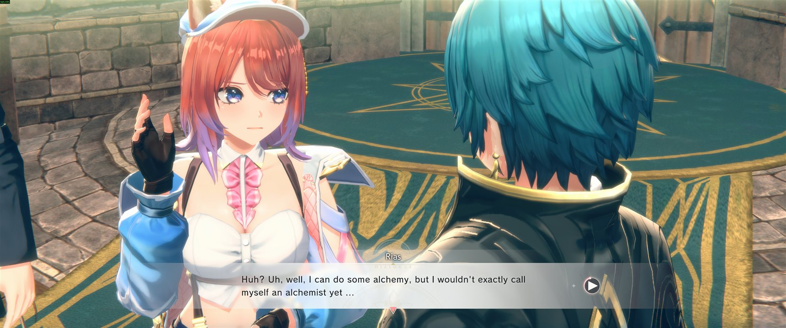
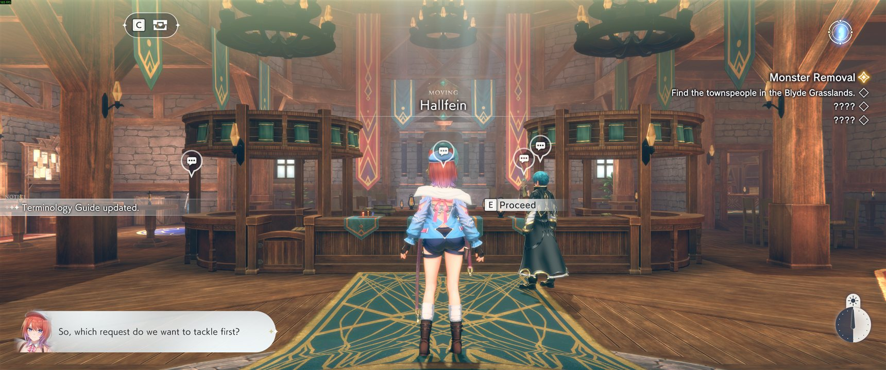
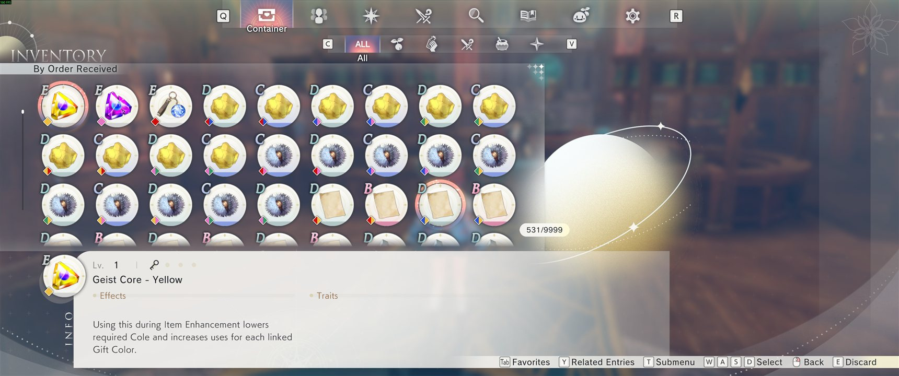
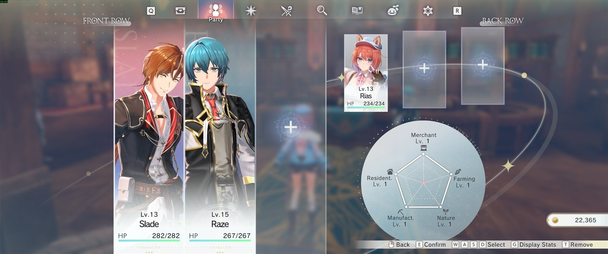
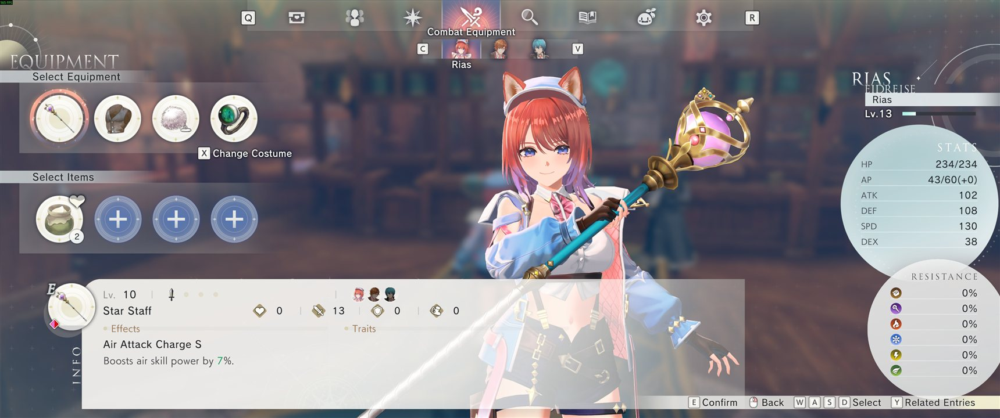
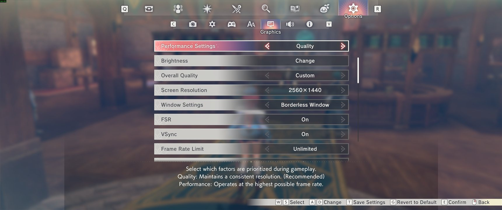
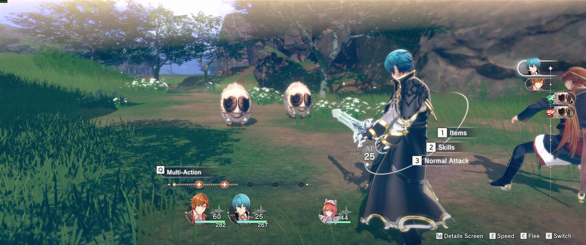
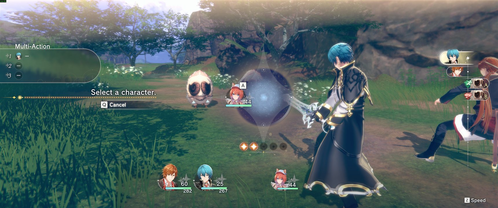
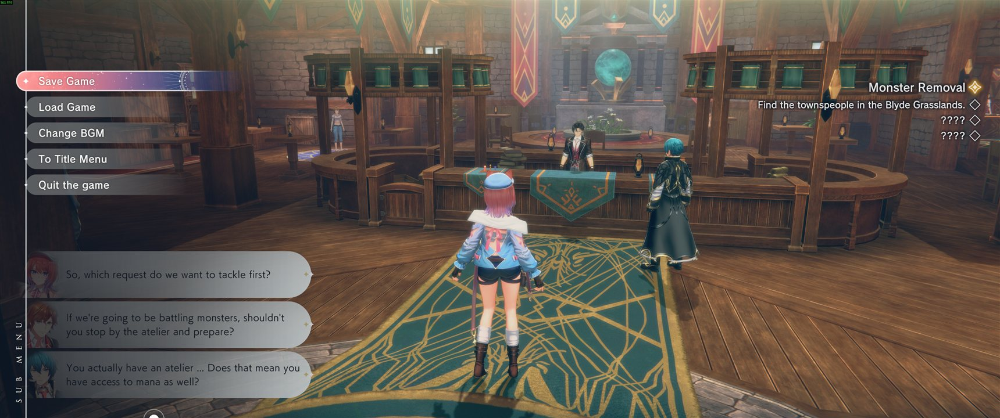
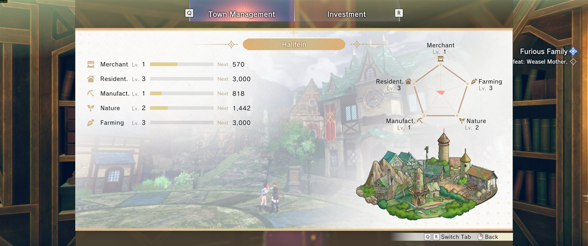

# AtelierReslerianaUltrawideFix

Ultrawide (21:9 / 32:9) fix for **Atelier Resleriana: The Red Alchemist & the White Guardian** (Steam, AppID 3259600).

The game offers no ultrawide resolution of its own, and forcing one leaves the UI sized wrong.
This forces the resolution, gives the 3D scene the full screen width, and corrects the UI the game then lays out badly.

Modelled on the structure of Lyall's `AtelierYumiaFix`: a single ASI plugin plus an INI, loaded by Ultimate ASI Loader.
The engine underneath is completely different from Atelier Yumia's, so the hooking strategy is different - see [docs/IMPLEMENTATION.md](docs/IMPLEMENTATION.md).

## Preview

All at 3440x1440, 21:9.

| | |
| --- | --- |
|  |  |
| Dialogue | Field and town |
|  |  |
| Inventory | Party |
|  |  |
| Equipment | Options |
|  |  |
| Battle | Battle, Multi-Action |
|  |  |
| Sub menu | Town Management |

Shots live in `docs/screenshots/`, resized to 1720px wide and saved as JPEG so the repository stays light; drop replacements in under the same names to refresh this section.

## Installing

Download `AtelierReslerianaUltrawideFix.zip` from [Releases](../../releases) and extract it into the game folder, normally:

```
C:\Program Files (x86)\Steam\steamapps\common\AtelierReslerianaRW
```

That is the whole install. Launch the game and it should come up at your monitor's full width.

No build tools, and nothing else to download: the archive already contains the loader.

```
AtelierReslerianaFix.asi     the fix
AtelierReslerianaFix.ini     settings, read at startup
version.dll                  Ultimate ASI Loader, which loads the .asi
licenses/                    the loader's MIT licence
```

To check it is running, open `AtelierReslerianaFix.log` in the game folder. It should end with `Hooks installed.`

The loader has to carry a name `UnityPlayer.dll` actually imports. `version.dll` is what ships here; `winmm.dll` and `winhttp.dll` work too, all three confirmed with `dumpbin /imports`. `dinput8.dll` does **not**: this game never loads it, which is the one place Lyall's Atelier Yumia setup does not carry over.

## Turning it off

Set `Enabled = false` under `[General]` in the INI, and restart the game. The plugin still loads but installs nothing, so the game runs exactly as it would without it.

Prefer that over switching off individual sections. `NudgeElements` is calibrated for the widened canvas, so leaving it on while the resolution returns to 16:9 pushes a menu panel out the other way.

To remove it entirely, delete `AtelierReslerianaFix.asi`, `AtelierReslerianaFix.ini` and `version.dll`. Renaming the `.asi` to any other extension also works, since the loader only picks up `*.asi`.

## Configuration

Everything is in `AtelierReslerianaFix.ini`, which is documented inline and read once at startup, so a restart applies changes. No rebuild is ever needed to change behaviour.

The settings worth knowing:

| Key | Default | What it does |
| --- | --- | --- |
| `[General] Enabled` | `true` | Master switch |
| `[Resolution] Enabled` | `true` | Forces a resolution the game's own list omits. `Width`/`Height` of `0` means the desktop resolution |
| `[Resolution] FullscreenMode` | `1` | 0 exclusive, 1 borderless, 2 maximised, 3 windowed |
| `[HUD] Mode` | `off` | `off` for a full-width picture, `viewport` to lock the HUD to 16:9 at the cost of black bars in full-screen menus |
| `[HUD] NudgeElements` | `Image_win:-660` | Shifts the description panel back under its own labels. Calibrated for `Mode = off` |
| `[AspectRatio] CorrectRenderTextureAspect` | `true` | Stops the Party screen's live character coming out 26 percent narrow |
| `[FOV] AdditionalVerticalFOV` | `0.0` | Extra vertical FOV, if you want a wider view than Hor+ already gives |

## Tested on

| | |
| --- | --- |
| Game | Atelier Resleriana: The Red Alchemist & the White Guardian, Steam, **ver. 1.3.2** |
| Engine | Unity 2022.3.56f1, IL2CPP, URP, Direct3D 11 |
| Display | **3440x1440 (21:9) at 165 Hz**, borderless, alongside a secondary 1920x1080 |
| GPU | AMD Radeon RX 9070 XT, driver 32.0.31041.1004 |
| CPU | AMD Ryzen 7 9700X |
| OS | Windows 11 Pro 24H2 (10.0.26200) |

Only 21:9 at 3440x1440 has actually been played. 32:9 should follow the same maths, since every correction is derived from the screen aspect rather than hard-coded, but it is untested - the one value likely to need retuning is `NudgeElements`, whose offset is half of how far the canvas grows.

## What the game actually is

Verified against the installed build, not from community rumour:

| Property | Value | How it was verified |
| --- | --- | --- |
| Engine | **Unity 2022.3.56f1**, not the Koei Tecmo engine | `globalgamemanagers`, `UnityPlayer.dll`, `UnityCrashHandler64.exe` |
| Scripting backend | **IL2CPP** | `GameAssembly.dll` + `il2cpp_data/` |
| Render pipeline | **URP** with camera stacks | `Unity.RenderPipelines.Universal.Runtime.dll`, `RenderCameraStack` in the player log |
| Graphics API | Direct3D 11 | player log |
| UI | uGUI (`UnityEngine.UI`, TextMeshPro) | `ScriptingAssemblies.json` |
| Camera driver | Cinemachine | `Cinemachine.dll` |
| Middleware | GameCreator 2, UniTask, UniRx, Addressables | `ScriptingAssemblies.json` |
| Game code | Obfuscated with Beebyte (`KLLPPJFFKLN`-style names) | player log stack traces |
| `global-metadata.dat` | **String table is encrypted** | header parse: zero plaintext identifiers in 40 MB |
| Anti-tamper | None | no Denuvo/VMProtect/Themida markers, stock PE sections |

The publisher folder is named `KoeiTecmo`, but there is no `.g1t`, no `.pak`, and no Koei Tecmo engine code.
This build reuses the mobile game's Unity codebase, which is why the internal namespace is `Broom` and the Addressables bundles are encrypted.

## Why not BepInEx or MelonLoader

Both generate their interop assemblies with Cpp2IL, which parses `global-metadata.dat` **from disk**.
This game's identifier string table is encrypted on disk, so that parse produces garbage.
The il2cpp runtime decrypts the names in memory during startup - the player log prints real names like `GameCreator.Runtime.Common.ShortcutMainCamera` - and `GameAssembly.dll` still exports all 254 il2cpp C API functions.

So this fix resolves every class, method and field **by name, at runtime, through those exports**, and never reads the metadata file.
That sidesteps the encryption entirely.

## What works

Verified in game at 3440x1440:

- Resolution forced to the full ultrawide, applied once and holding.
- 3D scene fills the whole screen in field and battle, and on the title screen.
- Root canvases corrected from `5160x2902` back to their `3840x2160` design size, so UI elements are their intended size rather than 26 percent small.
- The description panel sits under its own labels in Inventory, Equipment and Exploration Equipment.
- The Party screen's live 3D character has correct proportions.
- The shop screens hold together: the results sequence keeps its level bars and pentagon chart on screen, the Shop Management button keeps its own icon, and Shop Overview keeps the rank panel beside the task list.

The default `Mode = off` gives a full-width picture with no black bars and no HUD lock. It is the configuration verified end to end.

`Mode = viewport` is the alternative, and the only mode that truly locks the HUD to 16:9. Its cost is that in-game full-screen menus get black bars at the sides, because their backdrop is a UI element drawn by the very camera that has to be narrowed. Switching to it means clearing `NudgeElements`.
`Mode = anchors` was an attempt to have both, and it does not work on this game - see [docs/IMPLEMENTATION.md](docs/IMPLEMENTATION.md) for what it did and why.

## Building from source

Only needed if you want to change the code. Requires CMake 3.25+ and MSVC with a C++23 toolset; safetyhook, spdlog and inipp are fetched automatically.

```
cmake -S . -B build -G "Visual Studio 18 2026" -A x64
cmake --build build --config Release
pwsh -File scripts/package.ps1
```

The last step assembles the release archive, pulling the loader and its licence straight from upstream so the bundle is reproducible rather than hand-assembled.

## Licence

MIT, see [LICENSE](LICENSE).

## Credits

[Ultimate ASI Loader](https://github.com/ThirteenAG/Ultimate-ASI-Loader) by ThirteenAG, also MIT, redistributed in the release archive unmodified apart from its filename. Its licence travels in `licenses/` inside the archive.

Structure modelled on Lyall's `AtelierYumiaFix`, though the engine underneath is a different one and none of the hooking carries over.
